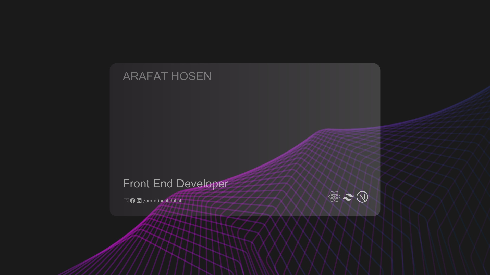

<a href="https://www.linkedin.com/in/arafatibnabdullah/">
<!--  -->

<!--  -->

</a>

 
 

**Assalamu Alaikum, I am Arafat Hosen, a dedicated and enthusiastic React front-end developer with a strong foundation in full-stack development. Over the past One Years , I have actively refined my expertise, with a particular focus on React.js. This period of dedicated learning reflects my commitment to crafting engaging and user-friendly front-end experiences.🚀**

 
 
  

## ❄️About me

🌱 &emsp; I’m currently learning **Next Js, Mongoose, C#, .NET, MYSQL**   
✌️ &emsp; Enjoy to do programming and sharing knowledge   
❤️ &emsp; Love to writing code and learning new features  
📧 &emsp; Reach me anytime: arfathossen541@gmail.com 
 
💬 &emsp; Ask me about anything [here](https://github.com/ibnabdullah1)
 

 

## 🏅 Achievements

- 🥇 Achieved the highest rank certificate 'BLACK BELT' from Programming Hero
   

 

## 💻 Tech Stack:

 

## 📊 Current Stats

  

 

  

  
  
 

 
 

## 🔗 Links

   
